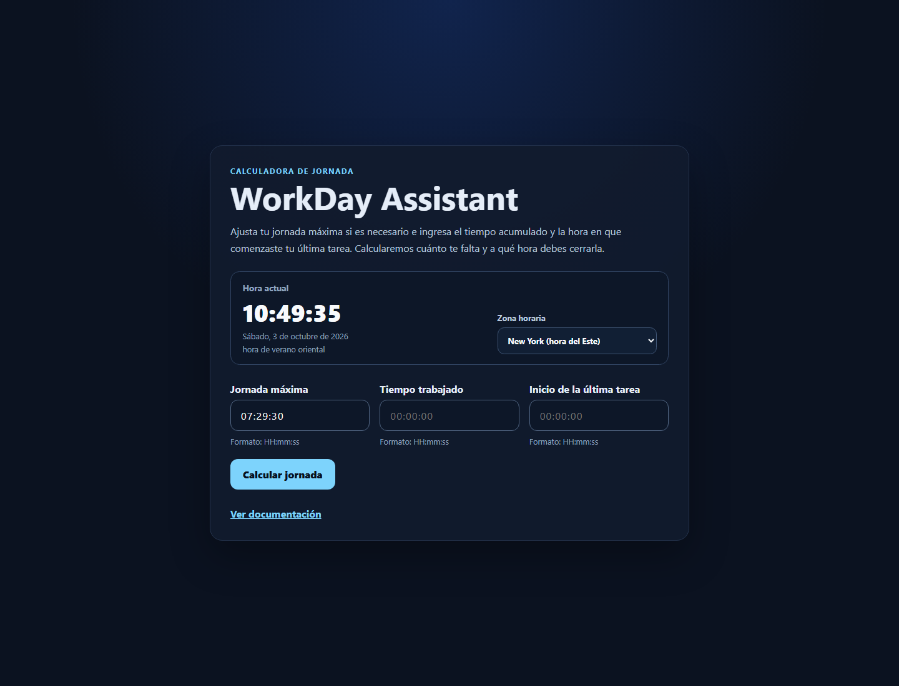

# WorkDay Assistant

[](https://github.com/dafermen/WorkDayAssistant/actions/workflows/ci.yml)

WorkDay Assistant is an Android-first React and TypeScript application that helps a ServiceNow
technician determine when the final task should be closed without exceeding an editable maximum
workday. The default is `07:29:30`.

Version `v0.2.0` provides the complete browser calculation and alarm workflow. The web application
is deployed through GitHub Pages at
[dafermen.github.io/WorkDayAssistant](https://dafermen.github.io/WorkDayAssistant/).

## Current application



The image above is captured from the actual production build. The calculator accepts numeric time
entry, inserts separators, and presents the result plus alarm state after the user selects
**Calcular e iniciar**.

## Implemented

- Strict `HH:mm:ss` validation with external-whitespace normalization.
- Time-to-seconds and seconds-to-time conversions.
- Remaining-time calculation against an editable maximum workday that defaults to `07:29:30`.
- Explicit over-limit warning data instead of negative countdowns.
- Recommended closing time with next-day rollover metadata.
- Final-minute and closing-state predicates.
- Accessible reusable time inputs for worked time and final-task start time.
- Functional calculator form with required/format validation, remaining time, recommended closing
  time, next-day indication, and an over-limit warning.
- Real-time clock initialized to `America/New_York`, with a selectable IANA time zone and automatic
  daylight-saving adjustment.
- Absolute countdown that resynchronizes against the device clock after returning from another tab
  or application, plus final-minute and closing visual states.
- Browser audio alarm primed by the **Calcular e iniciar** or **Probar alarma** user action.
- Numeric-first time entry: type four or six digits and the application inserts separators; four
  digits receive `00` seconds on completion.
- **Usar hora actual**, one-step **Calcular e iniciar**, explicit alarm status, alarm test, cancel,
  and new-workday actions.
- Capacitor Android project and web-to-native synchronization.
- Automated formatting, lint, tests, coverage, build, and GitHub CI.

## Quality baseline

- 122 automated tests across 21 files.
- More than 95% measured coverage in every configured category.
- Zero known production dependency vulnerabilities.
- Secret-pattern and sensitive-filename checks completed before the initial GitHub publication.
- Dependabot configured for npm and GitHub Actions updates.

See [Security](./SECURITY.md) and the [security audit](./docs/SECURITY_AUDIT.md) for the remaining
development-tool advisory and the validation scope.

## Requirements

- Node.js 24 or a compatible version supported by the locked dependencies.
- npm 11 or later.
- Java Development Kit and Android Studio only for native Android compilation.

## Local development

```bash
npm ci
npm run dev
```

Open the local URL shown by Vite.

Enter time values with four or six digits; separators are inserted automatically:

1. **Jornada máxima**: keep the default `07:29:30` or enter a different limit.
2. **Tiempo trabajado**: accumulated time immediately before starting the final task. Type `063000`
   for `06:30:00`, or `0630` for `06:30:00`.
3. **Inicio de la última tarea**: select **Usar hora actual**, or type the clock time yourself.
4. Confirm the displayed time zone and select **Calcular e iniciar**. The result, countdown, and
   alarm confirmation appear together.
5. Use **Probar alarma** before starting if you want to confirm the device volume.

If worked time is greater than the entered maximum, the application displays the selected limit and
how far it was exceeded, without presenting a misleading closing-time recommendation.

On a mobile browser, returning to the page immediately corrects any suspended timer. Browsers do not
guarantee that a web page can sound while it is closed or suspended in the background; a Capacitor
local-notification adapter remains the next mobile reliability task.

## Validation

```bash
npm run format:check
npm run lint
npm run test:coverage
npm run build
```

## Android synchronization

```bash
npm run build
npm run cap:sync
```

Opening and compiling the native Android project additionally requires Java, Android Studio, and the
Android SDK.

## Documentation

- [Project scope](./docs/PROJECT.md)
- [Architecture](./docs/ARCHITECTURE.md)
- [Roadmap](./docs/ROADMAP.md)
- [Tasks](./docs/TASKS.md)
- [Current status](./docs/STATUS.md)
- [Testing](./docs/TESTING.md)
- [Capacitor](./docs/CAPACITOR.md)
- [Deployment](./docs/DEPLOYMENT.md)
- [GitHub workflow](./docs/GITHUB_WORKFLOW.md)
- [Session handoff](./docs/SESSION_HANDOFF.md)

## Repository

<https://github.com/dafermen/WorkDayAssistant>

## DOC-STD-20261002 — Documentation navigation

Use the [documentation map](docs/README.md) for authoritative sources, reading paths and project-specific maintenance rules.
